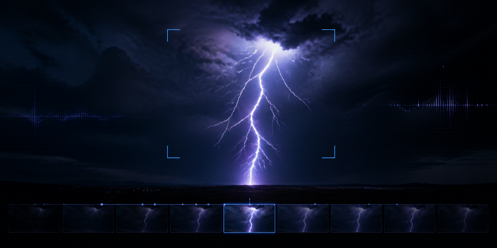

<p align="center">
  
</p>

<h1 align="center">⚡ Lightning Strike Extractor</h1>

<p align="center">
  <strong>Turn hours of storm footage into ranked lightning events, sharp stills, and structured data.</strong>
</p>

<p align="center">
  <a href="https://www.python.org/"></a>
  <a href="https://opencv.org/"></a>
  <a href="https://ffmpeg.org/"></a>
  
</p>

---

Lightning Strike Extractor is a Python command-line tool for scanning video,
detecting sudden lightning flashes, and ranking the frames most likely to show
a thin, visible lightning channel. It reads the original video in place and
exports full-resolution stills alongside JSON and CSV results.

Built for demanding footage such as **4K, 100 fps HEVC recordings**—without
uploading the video or modifying the source file.

> [!NOTE]
> The project is currently experimental. Detection thresholds work well on the
> reference nighttime footage but will need tuning for other cameras, exposure
> settings, weather conditions, and shooting environments.

## What it does

```text
video.mp4
   │
   ├── inspect media metadata with ffprobe
   ├── detect abrupt luminance and frame changes
   ├── group nearby detections into lightning events
   ├── score short-lived line geometry around every event
   └── export ranked full-resolution frames and structured results
```

- Detects flash candidates against a rolling luminance baseline
- Separates broad cloud illumination from thin channel-like structures
- Adapts time windows to the video's probed frame rate
- Accepts arbitrary local video paths
- Supports partial time ranges for fast experiments
- Produces reproducible, isolated run directories
- Keeps thresholds in a human-readable TOML configuration

## Quick start

### Requirements

- Python 3.11 or newer
- [FFmpeg](https://ffmpeg.org/) with `ffprobe` available on `PATH`
- [uv](https://docs.astral.sh/uv/) is recommended

### Install

```bash
git clone https://github.com/andregasser/lightning-strike-extractor.git
cd lightning-strike-extractor
uv sync --extra dev
```

### Inspect a video

```bash
uv run lightning inspect /path/to/storm.mp4
```

Example metadata:

```json
{
  "duration_seconds": 3072.0,
  "video": {
    "codec_name": "hevc",
    "width": 3840,
    "height": 2160,
    "fps": 100.0
  },
  "has_audio": true
}
```

### Analyze it

```bash
uv run lightning analyze /path/to/storm.mp4 \
  --config config/default.toml
```

The same command scales to any number of files and directories:

```bash
uv run lightning analyze \
  /Volumes/Storms/camera-a.mp4 \
  /Volumes/Storms/camera-b.mov \
  /Volumes/Storms/archive \
  --recursive
```

Inspect discovery without decoding video:

```bash
uv run lightning analyze /Volumes/Storms \
  --recursive \
  --include "*.mp4" \
  --exclude "*preview*" \
  --dry-run
```

Use a short range while tuning thresholds:

```bash
uv run lightning analyze /path/to/storm.mp4 \
  --start 250 \
  --end 270 \
  --top 10
```

Long runs write regular checkpoints. If a run is interrupted, continue the
exact same source, range, and configuration with `--resume`:

```bash
uv run lightning analyze /path/to/storm.mp4 \
  --config config/default.toml \
  --resume
```

Progress includes processed frames or events, throughput, elapsed time, and an
estimated time remaining. Re-running an existing analysis without `--resume`
is rejected to prevent accidental overwrites.

Videos run sequentially by default, which is safest for large HEVC sources on
one disk. Controlled concurrency is available when the hardware can support it:

```bash
uv run lightning analyze /Volumes/Storms \
  --recursive \
  --jobs 2 \
  --resume
```

One invalid video is recorded as failed while the remaining batch continues.
Use `--fail-fast` when the batch should stop scheduling new videos after the
first failure. Progress can be emitted as `auto`, `interactive`, `plain`,
`json`, or `quiet`.

## Output

Every source and analysis setup gets a stable run directory based on the source,
time range, configuration, and tool version:

```text
runs/
├── batches/
│   └── batch-248f7728284d/
│       ├── batch.json       # batch lifecycle and scheduler settings
│       ├── inputs.json      # resolved, reproducible input set
│       ├── summary.json
│       └── summary.csv
└── videos/
    └── storm-a84f29c1-2bb55de739/
        ├── run.json         # status, phase, identity, timestamps, errors
        ├── source.json      # probed codec, dimensions, FPS, duration
        ├── config.json      # exact settings used for this run
        ├── cache/
        │   ├── flash-scan/
        │   └── channel-ranking.json
        ├── results/
        │   ├── events.json
        │   ├── events.csv
        │   ├── candidates.json
        │   ├── candidates.csv
        │   └── summary.json
        ├── review/
        │   └── previews/   # generated five-frame manual-review strips
        └── exports/
            ├── contact-sheet.jpg
            ├── stills/
            └── events/
                └── evt_000001_000075.630s/
                    ├── frame_-02.jpg
                    ├── frame_-01.jpg
                    ├── frame_peak.jpg
                    ├── frame_+01.jpg
                    ├── frame_+02.jpg
                    └── slow-motion.mp4
```

Original media is never copied or changed. Raw videos, run outputs, caches, and
legacy generated artifacts are excluded from Git.

Inspect accumulated state at any time:

```bash
uv run lightning runs list
uv run lightning runs list --status failed
uv run lightning runs show runs/batches/batch-248f7728284d
```

## Manual verification

Label the currently selected channel candidates after an analysis:

```bash
uv run lightning review runs
```

For each event, the command creates a five-frame strip from two frames before
the selected peak through two frames after it, opens the strip in the system
image viewer, and prompts for a label:

```text
Lightning channel? [y]es/[n]o/[u]ncertain/[q]uit:
```

Each answer is written atomically to `runs/labels/review.json`. Re-running the
command skips completed items and continues with the first pending event. Use
`--include-reviewed` to revisit existing labels, `--labels /private/path.json`
to choose another label file, or `--no-open` when preview paths should only be
printed. Review data and previews live below ignored run directories and are
never committed automatically.

## Batch manifests

For large or repeatable collections, use a TOML manifest:

```bash
uv run lightning analyze --manifest storm-campaign.toml
```

```toml
[batch]
output = "runs"
jobs = 2
config = "config/default.toml"
resume = true

[[video]]
path = "/Volumes/Storms/camera-a.mp4"
start = 120.0
end = 1800.0

[[input]]
path = "/Volumes/Storms/archive"
recursive = true
include = ["*.mp4", "*.mov"]
exclude = ["*preview*", "*proxy*"]
```

Paths in a manifest are resolved relative to the manifest file. Each `video` or
`input` entry can override `config`, `start`, and `end`. See
[`examples/batch.example.toml`](examples/batch.example.toml) for a complete
template.

## Exit codes

| Code | Meaning |
| ---: | --- |
| `0` | All videos completed or were skipped |
| `1` | At least one video failed |
| `2` | Invalid arguments, configuration, or media |
| `3` | No supported videos were discovered |
| `4` | ffprobe is missing |
| `5` | Insufficient disk space |
| `130` | Interrupted by the user |

## How detection works

### 1. Flash detection

Frames are decoded sequentially at a reduced analysis resolution. Average
luminance, bright-pixel response, and frame-to-frame difference are compared
with a rolling baseline. Adaptive percentiles select exceptional changes, and
nearby hits collapse into a single event.

### 2. Channel ranking

The analyzer revisits a small window around each event. Local background
subtraction and temporal differencing isolate newly appearing bright ridges.
Hough line segments reward long, thin, multi-segment structures while broad
illumination is penalized.

### 3. Full-resolution export

Only candidates above the configured geometry threshold are exported, with one
representative frame per event by default. `top` is an upper limit rather than
a target that is filled with weak candidates. All candidates remain available
in JSON and CSV. Exported JPEGs preserve source resolution without making the
entire analysis operate on 4K frames.

## Configuration

Defaults live in [`config/default.toml`](config/default.toml):

```toml
[analysis]
width = 960
baseline_seconds = 0.30
event_gap_seconds = 0.75
rise_percentile = 0.995
diff_percentile = 0.995
keep_frames_per_event = 0

[channel]
analysis_width = 1920
stabilization_enabled = true
stabilization_width = 640
stabilization_max_features = 1200
stabilization_min_matches = 24
stabilization_min_inlier_ratio = 0.45
stabilization_ransac_threshold = 2.5
stabilization_orb_max_residual = 3.0
stabilization_ecc_enabled = true
stabilization_min_ecc_correlation = 0.90
stabilization_max_translation_fraction = 0.08
stabilization_max_rotation_degrees = 5.0
stabilization_max_scale_change = 0.05
stabilization_mask_aligned_edges = true
stabilization_edge_mask_dilation = 5
multiframe_enabled = true
multiframe_width = 640
multiframe_window_seconds = 0.06
multiframe_dilation_pixels = 3
multiframe_bonus_weight = 0.25
multiframe_template_min_support = 0.5
multiframe_peak_radius_frames = 2

[export]
top = 50
minimum_geometry_score = 50.0
minimum_channel_length = 100.0
minimum_line_segments = 3
minimum_channel_strength = 15.0
maximum_channel_thickness = 3.5
minimum_strong_geometry_score = 500.0
minimum_long_channel_length = 300.0
maximum_clean_channel_bright_area = 5000.0
minimum_clean_line_segments = 5
minimum_peak_geometry_score = 500.0
minimum_peak_channel_length = 200.0
one_frame_per_event = true
minimum_winner_geometry_ratio = 0.0
jpeg_quality = 96
contact_sheet_columns = 5
contact_sheet_context_frames = 2
contact_sheet_context_stride = 1
contact_sheet_include_overlay = true
event_frames_enabled = true
slow_motion_enabled = true
slow_motion_before_seconds = 0.25
slow_motion_after_seconds = 0.25
slow_motion_factor = 4.0
slow_motion_output_fps = 25
slow_motion_crf = 18
```

`keep_frames_per_event = 0` enables exhaustive selection: every decoded frame
from the dynamic interval around an event is measured and retained in the
candidate data. The exporter first rejects geometrically implausible frames,
then chooses the remaining frame with the greatest combined channel length,
quadratically weighted original-frame luminance, connected branching, and
clarity. Temporal response validates that a channel is new, but no longer acts
as a proxy for its visible brightness. Thickness receives only a linear clarity
penalty so that natural bloom around a powerful channel is not punished twice.
A channel must meet minimum length, line-segment, strength, and thickness
requirements. It must additionally be geometrically strong, genuinely long, or
cleanly isolated from a diffuse frame-wide brightening. Multi-frame overlap can
no longer replace missing channel geometry. A bright or saturated peak remains
eligible only when its exact adjacent template frame independently passes the
same strict channel test. This preserves powerful sky-illuminating return
strokes without promoting ordinary cloud illumination. The selected peak must
also retain visible evidence of its own: a 200-pixel channel, a geometry score
of 500, or a clean locally isolated channel. This prevents a valid neighbouring
template from promoting a peak that contains only diffuse cloud light.
A positive value restores an
optional early per-event limit for faster exploratory runs.

Before comparing an event frame with its pre-event background, the channel
ranker aligns the background with an affine camera-motion estimate. ORB feature
matches and RANSAC make the estimate robust against a newly appearing lightning
channel. When feature matches are ambiguous or leave excessive residual error,
ECC intensity alignment provides a second estimate. Translation, rotation,
scale, match quality, and correlation are accepted only within configured safety
limits; an implausible transform causes a safe fallback to the unaligned
comparison. Static-edge masking removes sub-pixel interpolation remnants after
successful alignment. Stabilization is analysis-only: exported JPEGs always
contain the original, unwarped video frame.

Multi-frame support compares each detected channel mask with the masks from the
immediately surrounding frames. Spatially recurring channel geometry receives
a bounded event-ranking bonus, helping distinguish a real developing discharge
from a one-frame artifact. Isolated channels are not penalized, so an extremely
short lightning strike remains eligible. Within each event, single-frame
quality remains the primary winner criterion; multi-frame support only resolves
a tie. Compact masks limit memory use, and the selected export is the strongest
original single frame rather than a synthetic frame stack.

For saturated peak frames where local differencing can temporarily lose the
channel itself, a strongly supported neighbouring channel mask acts as an event
template. The tool measures every original frame through that shared geometry,
allowing the truly brightest instant to win even when sky illumination reduces
local contrast. Template transfer is limited to two direct neighbouring frames
so a nearby broad exposure flash cannot inherit unrelated channel geometry. The
exported image remains the untouched original frame.

The contact sheet uses one row per selected event by default. Two original
frames before and after the winner surround a yellow-marked `PEAK` frame. The
peak label includes event ID, quality, geometry, channel length and strength,
branch count, and multi-frame support. An adjacent debug view marks the exact
channel mask used by the ranker in magenta with a yellow outline. The context
count, frame stride, and overlay are configurable, making temporal evolution
and scoring errors easy to verify without exporting review images as final
stills.

Each selected event also receives a high-resolution export directory. By
default it contains the same five original frames shown around the contact-sheet
peak, plus a two-second H.264 slow-motion clip made from 0.25 seconds before and
after the peak at four-times slowdown. Context count and stride control both the
contact sheet and high-resolution frame sequence. Slow-motion window, factor,
output frame rate, and quality are independently configurable. Audio is omitted
from these short review clips.

Copy the file to create camera- or scenario-specific profiles. Available
settings cover event windows, adaptive cutoffs, geometry thresholds, event
limits, and export quality.

## Supported media

Input support has two separate layers:

1. Discovery accepts an explicit set of filename extensions.
2. The contained video stream must be readable by both the local `ffprobe`
   installation and OpenCV's video backend.

### Explicitly discovered containers

| Container | Extensions | Status |
| --- | --- | --- |
| MPEG-4 / ISO Base Media | `.mp4`, `.m4v` | Explicitly supported |
| QuickTime | `.mov` | Explicitly supported |
| Matroska | `.mkv` | Explicitly supported |
| WebM | `.webm` | Explicitly supported |
| AVI | `.avi` | Explicitly supported |

Extension matching is case-insensitive. Files with other extensions are not
selected during file or directory discovery, even when the installed FFmpeg
build could technically decode them.

### Codecs

The project does not maintain a codec whitelist. Codec availability depends on
the OpenCV wheel/platform and the locally installed media backend. The current
reference footage verifies **HEVC/H.265 in MP4 at 4K and 100 fps** on macOS, and
the automated fixtures verify **Motion JPEG in AVI**.

These common combinations are expected to work when the local OpenCV backend
supports them, but are not all covered by project fixtures yet:

- H.264/AVC in MP4, MOV, or MKV
- HEVC/H.265 in MP4, MOV, or MKV
- VP8 or VP9 in WebM or MKV
- AV1 in MP4, WebM, or MKV
- ProRes in MOV
- Motion JPEG in AVI or MOV

`ffprobe` successfully reading a file is necessary but not sufficient: OpenCV
performs the actual frame decoding. Run both a metadata check and a short
analysis before committing to a long batch:

```bash
uv run lightning inspect /path/to/video.mp4
uv run lightning analyze /path/to/video.mp4 --start 0 --end 30
```

### Common formats not explicitly supported

The following common containers are currently excluded by discovery and must
not be presented as supported:

| Format | Typical extensions | Current behavior |
| --- | --- | --- |
| MPEG transport stream / AVCHD | `.ts`, `.mts`, `.m2ts` | Not discovered |
| MPEG program stream / DVD video | `.mpg`, `.mpeg`, `.vob` | Not discovered |
| Windows Media / ASF | `.wmv`, `.asf` | Not discovered |
| Flash Video | `.flv`, `.f4v` | Not discovered |
| 3GPP | `.3gp`, `.3g2` | Not discovered |
| Ogg video | `.ogv` | Not discovered |
| Material Exchange Format | `.mxf` | Not discovered |
| Animated images | `.gif`, animated WebP | Not supported as video input |
| Image sequences | numbered JPEG, PNG, TIFF, EXR | Not supported |
| Camera RAW video | `.braw`, `.r3d`, and similar | Not supported |
| Network streams | RTSP, HLS URLs, HTTP URLs | Not supported; inputs must be local files |

Renaming one of these files to a supported extension is not a reliable
workaround. Support requires adding the extension to discovery, verifying
ffprobe and OpenCV decoding, and adding a regression fixture.

### Additional limitations

- A readable video stream and a positive reported frame rate are required.
- Audio is optional and ignored during analysis.
- Constant-frame-rate video is the tested path. Variable-frame-rate input uses
  the reported average frame rate and is not yet fully validated.
- HDR, 10/12-bit, alpha-channel, and unusual pixel formats may be converted by
  the local decoder; detection quality for them is not currently guaranteed.
- Encrypted or DRM-protected media is not supported.
- Corrupt or truncated input is marked as failed instead of silently producing
  a complete run.

## Development

```bash
uv sync --extra dev
uv run python -m unittest discover -s tests -v
uv run ruff check .
```

The root-level Python scripts are the original research prototype. Production
code lives in [`src/lightning_extractor`](src/lightning_extractor), and project
conventions are documented in [`AGENTS.md`](AGENTS.md).

## Roadmap

The public, continuously maintained roadmap lives in [`TODO.md`](TODO.md).
Current priorities are full-length validation on real footage, an interactive
review workflow, and exports for accepted stills and clips.

## Contributing

Issues and focused pull requests are welcome. Please keep changes thematic, add
tests for detection behavior, and use [Conventional
Commits](https://www.conventionalcommits.org/).

If you test the extractor with a new camera or storm scene, sharing the relevant
metadata and configuration is especially valuable—even when the result is a
false positive.
